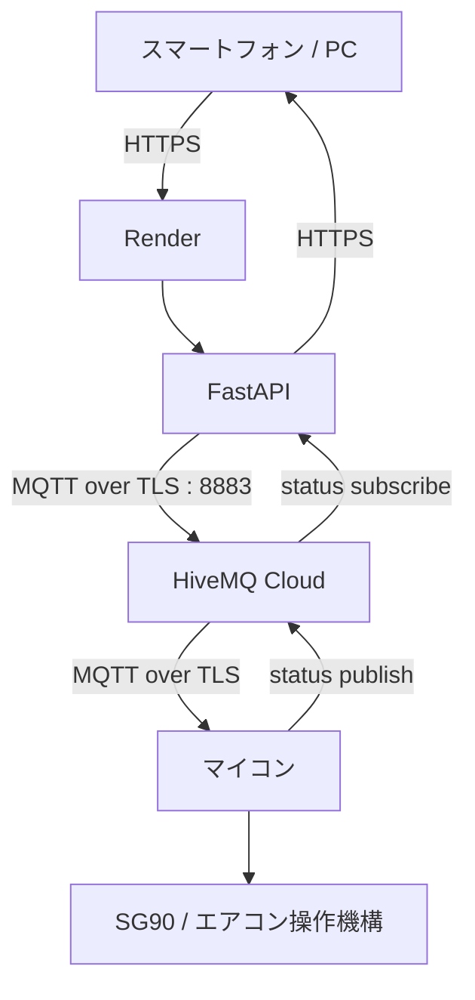

# Aircon Control App

スマートフォンやPCのブラウザから、MQTTを経由してエアコン操作用マイコンを遠隔操作するWebアプリです。

現在は **FastAPI + Render + HiveMQ Cloud** を中心に構成しており、共有パスワードでログインした利用者が `POWER`、`AUTO ON`、`AUTO OFF` を操作できます。

## 公開URL

https://aircon-server.onrender.com/control

## システム構成



通信の流れは次の通りです。

```text
スマホ
  ↓ HTTPS
Render上のFastAPI
  ↓ MQTT + TLS
HiveMQ Cloud
  ↓ MQTT + TLS
マイコン
  ↓
エアコン

マイコン
  ↓ 状態をPublish
HiveMQ Cloud
  ↓ FastAPIがSubscribe
スマホ画面に状態表示
```

## 使用技術

### FastAPI
Python製のWeb APIフレームワークです。

このプロジェクトでは次を担当します。

- ログイン処理
- 操作画面の配信
- MQTTへのコマンド送信
- MQTTから受信した状態の保持
- `/power`
- `/auto-on`
- `/auto-off`
- `/status`
- `/login`
- `/logout`

ブラウザからMQTT Brokerへ直接接続せず、FastAPIを間に置くことで、MQTTの認証情報を利用者側に持たせない構成にしています。

### Render
FastAPIをインターネット上で動かすために使用しています。

ローカル実行ではLAN内からしかアクセスできませんが、Renderへデプロイすることで外部ネットワークからHTTPSでアクセスできます。

公開URL:

```text
https://aircon-server.onrender.com/control
```

### HiveMQ Cloud
MQTT Brokerとして使用しています。

MQTT Brokerは、送信側と受信側の間でメッセージを中継します。

```text
FastAPI → HiveMQ Cloud → マイコン
マイコン → HiveMQ Cloud → FastAPI
```

接続は次の条件です。

```text
Protocol : MQTT over TLS
Port     : 8883
```

### MQTT
IoT機器向けの軽量メッセージングプロトコルです。

コマンド送信用Topic:

```text
yukimi/sg90
```

Payload:

| Payload | 動作 |
|---|---|
| `power` | エアコンの電源操作 |
| `auto_on` | 自動モードON |
| `auto_off` | 自動モードOFF |

状態通知用Topic:

```text
yukimi/sg90/status
```

マイコン側から実行結果や現在状態をPublishします。

例:

```text
電源:ON / 自動:OFF / 状態:電源ON
```

将来的にはJSONにすると扱いやすくなります。

```json
{
  "power": "ON",
  "auto": "OFF",
  "message": "電源をONにしました"
}
```

## 認証方式

現在はユーザーごとのアカウントではなく、**共有パスワード方式**です。

```text
パスワード入力
    ↓
FastAPIで照合
    ↓
セッションCookie発行
    ↓
/controlへ移動
    ↓
操作可能
```

FastAPIの `SessionMiddleware` でログイン状態を保持します。

将来的に必要なら、ユーザーごとの認証、操作履歴、管理者権限などを追加できます。

## MQTT接続

FastAPI起動時にHiveMQ Cloudへ接続します。

概念的には次の処理です。

```python
client.username_pw_set(
    MQTT_USERNAME,
    MQTT_PASSWORD
)

client.tls_set_context(
    ssl.create_default_context()
)

client.connect(
    MQTT_BROKER,
    8883,
    60
)
```

接続後に状態TopicをSubscribeします。

```python
client.subscribe("yukimi/sg90/status")
```

Web画面でPOWERを押すと、

```text
POST /power
```

がFastAPIへ送られ、FastAPIがMQTTへ次をPublishします。

```text
Topic   : yukimi/sg90
Payload : power
```

## Web API

### `GET /`
`/control` へリダイレクトします。

### `GET /login`
共有パスワード入力画面を表示します。

### `POST /login`
パスワードを照合してログインセッションを作成します。

### `GET /logout`
セッションを削除してログアウトします。

### `GET /control`
エアコン操作画面を表示します。未ログインの場合は `/login` へ移動します。

### `POST /power`
MQTTへ `power` を送信します。

### `POST /auto-on`
MQTTへ `auto_on` を送信します。

### `POST /auto-off`
MQTTへ `auto_off` を送信します。

### `GET /status`
FastAPIがMQTTから最後に受信した状態を返します。Web画面は定期的にこのAPIを取得します。

## ディレクトリ構成

```text
my_app/
├── aircon_server/
│   ├── main.py
│   ├── requirements.txt
│   └── .env
├── fake_device/
│   ├── fake_device.py
│   └── .env
├── .gitignore
└── README.md
```

`.env` はGitHubへアップロードしません。

## Pythonパッケージ

`aircon_server/requirements.txt`

```text
fastapi
uvicorn[standard]
paho-mqtt
python-dotenv
itsdangerous
```

インストール:

```powershell
python -m pip install -r requirements.txt
```

## 環境変数

ローカル開発では `.env` を使用します。

```env
MQTT_BROKER=YOUR_HIVEMQ_HOST
MQTT_USERNAME=YOUR_MQTT_USERNAME
MQTT_PASSWORD=YOUR_MQTT_PASSWORD
APP_PASSWORD=YOUR_SHARED_APP_PASSWORD
SESSION_SECRET=YOUR_RANDOM_SESSION_SECRET
```

秘密情報はGitHubへコミットしないでください。

`.gitignore`:

```gitignore
.env
**/.env
__pycache__/
**/__pycache__/
*.pyc
.venv/
venv/
```

## SESSION_SECRET

ログインセッションのCookie署名に使用します。

生成例:

```powershell
python -c "import secrets; print(secrets.token_urlsafe(48))"
```

生成した値を `SESSION_SECRET` として設定します。

## ローカル起動

```powershell
cd C:\Users\kobat\Documents\my_app\aircon_server

python -m uvicorn main:app --reload --host 0.0.0.0 --port 8000
```

PC:

```text
http://127.0.0.1:8000/control
```

同じLAN内のスマホから使う場合は、

```powershell
ipconfig
```

でPCのIPv4アドレスを確認します。

例:

```text
http://192.168.0.25:8000/control
```

## fake_device

マイコンが手元にないときは、PC上の `fake_device.py` を仮マイコンとして利用できます。

```text
スマホ
 ↓
Render / FastAPI
 ↓
HiveMQ Cloud
 ↓
fake_device.py
```

`fake_device.py` は、

```text
yukimi/sg90
```

をSubscribeし、`power`、`auto_on`、`auto_off` を受信します。

受信後、

```text
yukimi/sg90/status
```

へ状態を返します。

これにより、本物のマイコンがなくてもWeb画面からMQTTまでの一連の通信を確認できます。

## Renderへのデプロイ

RenderではGitHubリポジトリを接続します。

Root Directory:

```text
aircon_server
```

Build Command:

```text
pip install -r requirements.txt
```

Start Command:

```text
uvicorn main:app --host 0.0.0.0 --port $PORT
```

Render側のEnvironment Variables:

```text
MQTT_BROKER
MQTT_USERNAME
MQTT_PASSWORD
APP_PASSWORD
SESSION_SECRET
```

## GitHubへの更新

```powershell
cd C:\Users\kobat\Documents\my_app

git add .
git commit -m "Update application"
git push
```

RenderとGitHubを連携しているため、`main` ブランチへPushすると新しいコードがデプロイされます。

## 本物のマイコンで必要な設定

マイコンが手元に来たら、HiveMQ Cloudへ接続します。

```text
Host     : HiveMQ Cloudのホスト名
Port     : 8883
TLS      : 有効
Username : HiveMQ CloudのMQTTユーザー
Password : HiveMQ CloudのMQTTパスワード
```

Subscribe:

```text
yukimi/sg90
```

受信処理:

```text
power
→ 電源操作

auto_on
→ 自動モードON

auto_off
→ 自動モードOFF
```

処理後に、

```text
yukimi/sg90/status
```

へ状態をPublishします。

## セキュリティ

現在の構成では以下を行っています。

- スマホとRender間はHTTPS
- FastAPIとHiveMQ Cloud間はMQTT over TLS
- HiveMQ Cloudへのユーザー名・パスワード認証
- 操作画面は共有パスワード認証
- ログイン状態はセッションCookieで保持
- MQTTパスワードなどは環境変数で管理
- `.env` はGitHubにアップロードしない

### なぜブラウザからMQTTへ直接つながないのか

直接接続すると、MQTTの認証情報をブラウザやアプリ側へ渡す必要があります。

そのため、

```text
スマホ
 ↓ HTTPS
FastAPI
 ↓ MQTT
HiveMQ Cloud
```

という構成にしています。

FastAPIを入口にすることで、

- MQTT認証情報を利用者へ配らない
- 利用できる操作をAPI側で制限できる
- 将来的に操作履歴やユーザー管理を追加しやすい

という利点があります。

## 現在の完成状況

- [x] MQTTによる操作
- [x] FastAPI API
- [x] スマホ向けWeb画面
- [x] MQTT状態受信
- [x] HiveMQ Cloud
- [x] MQTT over TLS
- [x] `.env` による秘密情報管理
- [x] Git / GitHub管理
- [x] Renderへのクラウドデプロイ
- [x] 外部ネットワークからアクセス
- [x] 共有パスワードログイン
- [x] Cookieによるログイン状態維持
- [x] fake_deviceによるテスト
- [ ] 実マイコンをHiveMQ Cloudへ接続
- [ ] 状態のJSON化
- [ ] 操作履歴
- [ ] 複数ユーザー管理
- [ ] 複数エアコン対応
- [ ] PWA / ネイティブアプリ化

## 使用サービス・ライブラリ

| 種類 | 技術 | 用途 |
|---|---|---|
| Web API | FastAPI | API、認証、操作画面 |
| ASGI Server | Uvicorn | FastAPIの実行 |
| MQTT Client | paho-mqtt | MQTT送受信 |
| MQTT Broker | HiveMQ Cloud | MQTTメッセージ中継 |
| TLS | Python `ssl` | MQTT通信暗号化 |
| Hosting | Render | FastAPIをクラウドで実行 |
| Version Control | Git / GitHub | ソースコード管理 |
| Environment | python-dotenv | `.env` 読み込み |
| Session | SessionMiddleware | ログイン状態維持 |
| Test Device | fake_device.py | マイコン代替 |

## まとめ

このシステムは、スマホからマイコンへ直接接続するのではなく、FastAPIとMQTT Brokerを間に入れています。

```text
利用者
 ↓
FastAPI
 ↓
HiveMQ Cloud
 ↓
マイコン
 ↓
エアコン
```

FastAPIがWeb側の入口、HiveMQ CloudがIoTメッセージの中継、マイコンが実際のエアコン操作を担当します。

各部分を分離しているため、Web画面、クラウド、MQTT、マイコンをそれぞれ独立して開発・テストできます。
