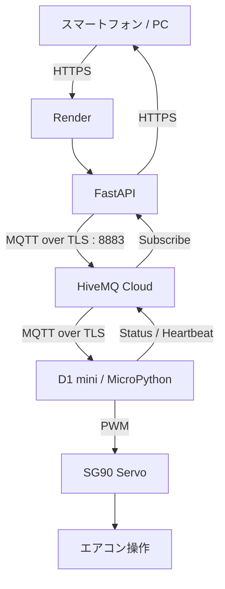

# Aircon Control App

スマートフォンやPCのブラウザから、MQTTを経由してエアコン操作用マイコンを遠隔操作するWebアプリです。

現在は以下の構成で実際のマイコンまで接続して動作しています。

- FastAPI
- Render
- HiveMQ Cloud
- MQTT over TLS
- ESP8266 D1 mini
- MicroPython
- SG90 サーボモーター

共有パスワードでログインした利用者が、

- `POWER`
- `AUTO ON`
- `AUTO OFF`

を操作できます。

マイコンからは現在状態をJSON形式で返し、さらにHeartbeatを定期送信することで、Web画面からD1 miniがオンラインかどうか確認できます。


# 公開URL

操作画面:

```text
https://aircon-server.onrender.com/control
```

システム状況画面:

```text
https://aircon-server.onrender.com/health-page
```


# システム構成



通信の流れは次のようになります。

```text
スマートフォン / PC
        ↓
      HTTPS
        ↓
Render / FastAPI
        ↓
 MQTT over TLS
        ↓
HiveMQ Cloud
        ↓
 MQTT over TLS
        ↓
ESP8266 D1 mini
        ↓
       PWM
        ↓
      SG90
        ↓
エアコンの物理ボタン
```

状態通知は逆方向に送信されます。

```text
D1 mini
   ↓
Status / Heartbeat Publish
   ↓
HiveMQ Cloud
   ↓
FastAPI Subscribe
   ↓
Web画面
```


# 使用技術

| 種類 | 技術 | 用途 |
|---|---|---|
| Web API | FastAPI | API、認証、Web画面 |
| ASGI Server | Uvicorn | FastAPI実行 |
| MQTT Client | paho-mqtt | Render側MQTT通信 |
| MQTT Broker | HiveMQ Cloud | MQTT中継 |
| Hosting | Render | FastAPI公開 |
| Microcontroller | ESP8266 D1 mini | エアコン制御 |
| Firmware | MicroPython | D1 mini制御 |
| MQTT Client | umqtt.simple | マイコン側MQTT通信 |
| Servo | SG90 | エアコンの物理ボタン操作 |
| TLS | SSL/TLS | MQTT通信暗号化 |
| Version Control | Git / GitHub | ソースコード管理 |
| Environment | python-dotenv | `.env` 読み込み |
| Session | SessionMiddleware | ログイン状態維持 |


# 現在のアーキテクチャ

ブラウザからHiveMQ Cloudへ直接接続せず、FastAPIを経由します。

```text
利用者
  ↓ HTTPS
FastAPI
  ↓ MQTT
HiveMQ Cloud
  ↓ MQTT
D1 mini
  ↓
SG90
  ↓
エアコン
```

この構成にすることで、MQTTのユーザー名・パスワードをブラウザ側へ公開する必要がありません。


# FastAPI

Python製のWeb APIフレームワークです。

このプロジェクトでは次を担当します。

- ログイン認証
- セッション管理
- 操作画面の配信
- MQTTへのコマンド送信
- MQTT状態TopicのSubscribe
- Heartbeat受信
- D1 miniのオンライン判定
- システム状況画面


# Render

FastAPIをインターネット上で公開するために使用しています。

ローカルPCを起動していなくても、Render上のFastAPIがHiveMQ Cloudへ接続します。

```text
スマホ
 ↓
インターネット
 ↓
Render
 ↓
HiveMQ Cloud
 ↓
D1 mini
```

そのため、現在はPCを常時起動する必要はありません。


# HiveMQ Cloud

MQTT Brokerとして使用しています。

接続条件:

```text
Protocol : MQTT over TLS
Port     : 8883
```

FastAPIとD1 miniの両方がHiveMQ Cloudへ接続します。


# MQTT Topic

## コマンドTopic

```text
yukimi/sg90
```

FastAPIからD1 miniへ送信します。

| Payload | 動作 |
|---|---|
| `power` | 電源ボタン操作 |
| `auto_on` | 自動モードON |
| `auto_off` | 自動モードOFF |


# Status Topic

```text
yukimi/sg90/status
```

D1 miniからFastAPIへ現在状態を送信します。

現在はJSON形式です。

例:

```json
{
  "power": "ON",
  "auto": "OFF",
  "message": "電源をONにしました"
}
```

FastAPIはこのTopicをSubscribeして、最後に受信した状態を保持します。


# Heartbeat Topic

D1 miniの生存確認用Topicです。

```text
yukimi/sg90/heartbeat
```

D1 miniは約30秒ごとにHeartbeatをPublishします。

例:

```json
{
  "device": "d1mini",
  "status": "online"
}
```

FastAPIは最後にHeartbeatまたはStatusを受信した時刻を保存します。

一定時間通信がない場合は、

```text
D1 mini
● OFFLINE
```

と判定します。

現在は約90秒以内に通信があればONLINEとして扱います。


# システム状況画面

以下のURLから確認できます。

```text
https://aircon-server.onrender.com/health-page
```

表示内容:

```text
Web Server     ● ONLINE

MQTT Broker    ● CONNECTED

D1 mini        ● ONLINE

最終確認       8秒前

Server Uptime  2時間13分

電源           ON

自動           OFF

状態           電源をONにしました
```

これにより、

```text
FastAPIが動いているか
MQTT Brokerへ接続できているか
D1 miniが動いているか
最後にいつ通信したか
```

をブラウザから確認できます。


# Web API

## `GET /`

`/control` へリダイレクトします。


## `GET /login`

共有パスワード入力画面を表示します。


## `POST /login`

共有パスワードを照合します。

成功するとSession Cookieを発行します。


## `GET /logout`

ログインセッションを削除します。


## `GET /control`

エアコン操作画面を表示します。

未ログインの場合は `/login` へ移動します。


## `POST /power`

MQTTへ次をPublishします。

```text
Topic   : yukimi/sg90
Payload : power
```


## `POST /auto-on`

```text
Topic   : yukimi/sg90
Payload : auto_on
```


## `POST /auto-off`

```text
Topic   : yukimi/sg90
Payload : auto_off
```


## `GET /status`

FastAPIが最後に受信したマイコンの状態を返します。

例:

```json
{
  "power": "ON",
  "auto": "OFF",
  "message": "電源をONにしました"
}
```


## `GET /health`

システム状態をJSON形式で返します。

例:

```json
{
  "server": "online",
  "mqtt": "connected",
  "device": "online",
  "last_seen_seconds": 5,
  "uptime_seconds": 7200,
  "power": "ON",
  "auto": "OFF",
  "message": "電源をONにしました"
}
```


## `GET /health-page`

スマートフォン向けのシステム状況画面を表示します。


# 認証

現在はユーザーごとのアカウントではなく、共有パスワード方式です。

```text
共有パスワード入力
        ↓
FastAPIで確認
        ↓
Session Cookie
        ↓
/control
        ↓
操作可能
```

FastAPIの `SessionMiddleware` を使用しています。

Session CookieにはMQTTパスワードなどの秘密情報は保存しません。


# D1 mini

使用しているマイコンは、

```text
ESP8266 D1 mini
```

です。

FirmwareはMicroPythonです。


# D1 mini 起動処理

D1 miniに電源を入れると、MicroPythonが自動的に、

```text
boot.py
 ↓
main.py
```

の順番で実行します。

したがってD1 mini本体へ `main.py` として保存しておけば、PCを接続していなくても電源投入だけで自動起動します。

起動後は、

```text
電源ON
 ↓
MicroPython起動
 ↓
main.py
 ↓
Wi-Fi接続
 ↓
NTP時刻同期
 ↓
HiveMQ Cloud接続
 ↓
MQTT Subscribe
 ↓
Status送信
 ↓
Heartbeat送信開始
```

となります。


# D1 mini MQTT接続

HiveMQ CloudへTLSで接続します。

```text
Host     : HiveMQ Cloud Host
Port     : 8883
TLS      : Enabled
Username : HiveMQ Cloud User
Password : HiveMQ Cloud Password
```

MicroPython側では `umqtt.simple.MQTTClient` を使用しています。

概念的には次のような接続です。

```python
client = MQTTClient(
    CLIENT_ID,
    BROKER,
    port=8883,
    user=MQTT_USERNAME.encode(),
    password=MQTT_PASSWORD.encode(),
    keepalive=60,
    ssl=True,
    ssl_params={
        "server_hostname": BROKER
    }
)
```

接続後、

```text
yukimi/sg90
```

をSubscribeします。


# SG90 サーボ

SG90を使用してエアコンの物理ボタンを押します。

MicroPythonでは、

```python
servo = PWM(
    Pin(14),
    freq=50
)
```

としているため、

```text
GPIO14 = D5
```

をServoの信号線として使用します。


# 配線

基本配線:

```text
D1 mini D5 / GPIO14
        │
        └──── SG90 Signal

5V
 │
 └────────── SG90 VCC

GND
 │
 ├────────── SG90 GND
 │
 └────────── D1 mini GND
```

SG90の一般的な配線色:

| SG90 | 接続先 |
|---|---|
| オレンジ / 黄色 | D1 mini `D5` |
| 赤 | `5V` |
| 茶 / 黒 | `GND` |

GNDはD1 miniとサーボで共通にします。

SG90をD1 miniの3.3V端子から駆動することは推奨しません。

サーボ動作時の電流不足で、

```text
D1 mini再起動
Wi-Fi切断
MQTT切断
```

が起きる可能性があります。


# SG90 動作

Servoはエアコンのボタンを物理的に押します。

現在の動作:

```text
通常位置
  ↓
約73度まで移動
  ↓
0.5秒待機
  ↓
0度へ戻る
```

概念的には、

```python
move(73)

sleep(0.5)

move(0)
```

です。


# 電源状態について

現在の `power` 状態は、エアコン本体からセンサーで取得している実際の状態ではありません。

D1 mini内部で、

```text
最後にON操作した
最後にOFF操作した
```

という情報を元に管理している論理状態です。

そのため、

- エアコン付属リモコンから操作した場合
- 本体ボタンを直接押した場合
- D1 miniを再起動した場合

などは実際のエアコン状態とWeb画面が一致しなくなる可能性があります。

将来的に赤外線受信や電流センサーなどを追加すると、実際の状態検出が可能になります。


# AUTOモード

現在の自動モード対象時間は、

```text
18:00 ～ 翌朝08:00
```

です。

その時間以外に `AUTO ON` を押した場合、

```text
時間外なので自動開始しません
```

という状態を返します。

時刻はNTPからUTCを取得し、9時間加算してJSTとして使用しています。


# NTP

起動時にNTPで時刻同期します。

```text
NTP
 ↓
UTC取得
 ↓
+9時間
 ↓
JST
```

また、長時間稼働時の時刻ずれ対策として定期的に再同期します。


# MQTT接続維持

D1 miniはMQTT接続維持のため定期的にPingを送信します。

```text
MQTT ping
```

MQTTやWi-Fiが切断された場合は再接続を試みます。


# Heartbeat

D1 miniは約30秒ごとに、

```text
Heartbeat published
```

を実行します。

これにより、FastAPI側からD1 miniが現在動いているか判定できます。


# ディレクトリ構成

```text
my_app/

├── aircon_server/
│   ├── main.py
│   ├── requirements.txt
│   └── .env
│
├── fake_device/
│   ├── fake_device.py
│   └── .env
│
├── .gitignore
│
└── README.md
```

D1 miniの `main.py` はマイコン本体へ保存します。


# Pythonパッケージ

`aircon_server/requirements.txt`

```text
fastapi
uvicorn[standard]
paho-mqtt
python-dotenv
itsdangerous
```

インストール:

```powershell
python -m pip install -r requirements.txt
```


# 環境変数

ローカル開発では `.env` を使用します。

```env
MQTT_BROKER=YOUR_HIVEMQ_HOST
MQTT_USERNAME=YOUR_MQTT_USERNAME
MQTT_PASSWORD=YOUR_MQTT_PASSWORD

APP_PASSWORD=YOUR_SHARED_APP_PASSWORD

SESSION_SECRET=YOUR_RANDOM_SESSION_SECRET
```

実際の秘密情報はGitHubへコミットしません。


# `.gitignore`

```gitignore
.env
**/.env

__pycache__/
**/__pycache__/

*.pyc
*.pyo
*.pyd

.venv/
venv/

.vscode/
.idea/

.DS_Store
Thumbs.db
```


# SESSION_SECRET

ログインSession Cookieの署名に使用します。

生成例:

```powershell
python -c "import secrets; print(secrets.token_urlsafe(48))"
```

生成した値をRenderの、

```text
SESSION_SECRET
```

へ設定します。


# ローカル起動

```powershell
cd C:\Users\kobat\Documents\my_app\aircon_server

python -m uvicorn main:app --reload --host 0.0.0.0 --port 8000
```

PCから:

```text
http://127.0.0.1:8000/control
```

同じLAN内のスマートフォンから使用する場合は、

```powershell
ipconfig
```

でPCのIPv4アドレスを確認します。

例:

```text
http://192.168.0.25:8000/control
```


# fake_device

現在は実際のD1 miniが接続されていますが、開発・テスト用として `fake_device.py` も残しています。

D1 miniを使わずに、

```text
スマホ
 ↓
Render / FastAPI
 ↓
HiveMQ Cloud
 ↓
fake_device.py
```

という通信テストが可能です。

実マイコン運用中は `fake_device.py` を同時に起動しない方が安全です。

同じTopicをSubscribeしているため、両方がコマンドを受信する可能性があります。


# Renderへのデプロイ

RenderではGitHubリポジトリを接続しています。

Root Directory:

```text
aircon_server
```

Build Command:

```text
pip install -r requirements.txt
```

Start Command:

```text
uvicorn main:app --host 0.0.0.0 --port $PORT
```

Render Environment Variables:

```text
MQTT_BROKER
MQTT_USERNAME
MQTT_PASSWORD
APP_PASSWORD
SESSION_SECRET
```

秘密情報はソースコードへ直接記述しません。


# GitHubへの更新

```powershell
cd C:\Users\kobat\Documents\my_app

git add .

git commit -m "Update application"

git push
```

RenderとGitHubを連携しているため、Push後にRender側で新しいコードがデプロイされます。


# セキュリティ

現在は次の対策を行っています。

- スマートフォンとRender間はHTTPS
- FastAPIとHiveMQ Cloud間はMQTT over TLS
- D1 miniとHiveMQ Cloud間もMQTT over TLS
- HiveMQ Cloud Username / Password認証
- Web画面は共有パスワード認証
- Session Cookieでログイン状態を保持
- MQTT認証情報はブラウザへ送信しない
- Render側の秘密情報はEnvironment Variablesで管理
- ローカル秘密情報は `.env` で管理
- `.env` はGitHubへアップロードしない


# なぜブラウザからMQTTへ直接接続しないのか

ブラウザからHiveMQ Cloudへ直接接続すると、MQTT認証情報をクライアント側へ持たせる必要があります。

現在は、

```text
ブラウザ
  ↓
 HTTPS
  ↓
FastAPI
  ↓
 MQTT
  ↓
HiveMQ Cloud
```

としています。

これにより、

- MQTT認証情報を利用者へ公開しない
- 使用可能なコマンドをFastAPI側で制限できる
- 操作履歴を将来的に追加しやすい
- ユーザー管理を追加しやすい
- 複数デバイスへ拡張しやすい

という利点があります。


# 現在の完成状況

- [x] MQTTによる操作
- [x] FastAPI API
- [x] スマートフォン向けWeb画面
- [x] HiveMQ Cloud
- [x] FastAPI → HiveMQ Cloud TLS接続
- [x] D1 mini → HiveMQ Cloud TLS接続
- [x] 実マイコンによる操作
- [x] SG90サーボ制御
- [x] MicroPython
- [x] MQTT状態受信
- [x] JSON形式の状態通知
- [x] Heartbeat
- [x] D1 mini ONLINE / OFFLINE判定
- [x] システム状況画面
- [x] NTPによるJST時刻管理
- [x] Wi-Fi再接続
- [x] MQTT再接続
- [x] `.env` による秘密情報管理
- [x] Git / GitHub管理
- [x] Renderへのクラウドデプロイ
- [x] 外部ネットワークからアクセス
- [x] 共有パスワードログイン
- [x] Cookieによるログイン状態維持
- [x] fake_deviceによるテスト
- [x] PCなしでのマイコン単独運転
- [ ] 実際のエアコン電源状態のセンサー取得
- [ ] 操作履歴
- [ ] 複数ユーザー管理
- [ ] 管理者権限
- [ ] 複数エアコン対応
- [ ] PWA化
- [ ] ネイティブアプリ化


# 現在の運用構成

現在はPCを常時起動する必要はありません。

```text
スマートフォン
      ↓
   Internet
      ↓
    Render
      ↓
HiveMQ Cloud
      ↓
   Wi-Fi
      ↓
   D1 mini
      ↓
     SG90
      ↓
   エアコン
```

D1 miniはUSB電源などから給電されていれば、起動時に `main.py` を自動実行します。


# 動作確認

正常起動するとD1 miniのシリアルには概ね次のように表示されます。

```text
WiFi OK

NTP sync OK

MQTT connecting...

MQTT connected

Subscribed: b'yukimi/sg90'

MQTT ready

STATUS: {"auto": "OFF", "message": "MQTT接続完了", "power": "OFF"}

STATUS published

Heartbeat published
```

Web画面から `POWER` を押すと、

```text
MQTT RX: b'yukimi/sg90' b'power'

STATUS: {"auto": "OFF", "message": "電源をONにしました", "power": "ON"}

STATUS published
```

のようになります。


# 今後の改善

現在の大きな課題は、Web画面上の電源状態がD1 mini内部の推定値であり、エアコン本体の実際の状態を直接取得していないことです。

将来的には、

```text
電流センサー
赤外線受信
温度センサー
電源状態検出
```

などを追加することで、より正確な状態管理が可能になります。

また、データベースを追加すれば、

```text
誰が
いつ
どの操作を行ったか
```

という操作履歴を保存することもできます。


# まとめ

このシステムでは、Web、クラウド、MQTT、マイコン、物理制御を分離しています。

```text
利用者
 ↓
FastAPI
 ↓
HiveMQ Cloud
 ↓
D1 mini
 ↓
SG90
 ↓
エアコン
```

D1 miniからは、

```text
状態通知
Heartbeat
```

をHiveMQ Cloudへ返します。

そのため、スマートフォンからエアコンを操作するだけでなく、

```text
Renderが動いているか
MQTTにつながっているか
D1 miniが動いているか
現在の論理状態
```

も確認できます。

現在は実際のD1 miniとSG90まで接続済みで、PCを常時起動せずにインターネット経由で操作できる構成になっています。